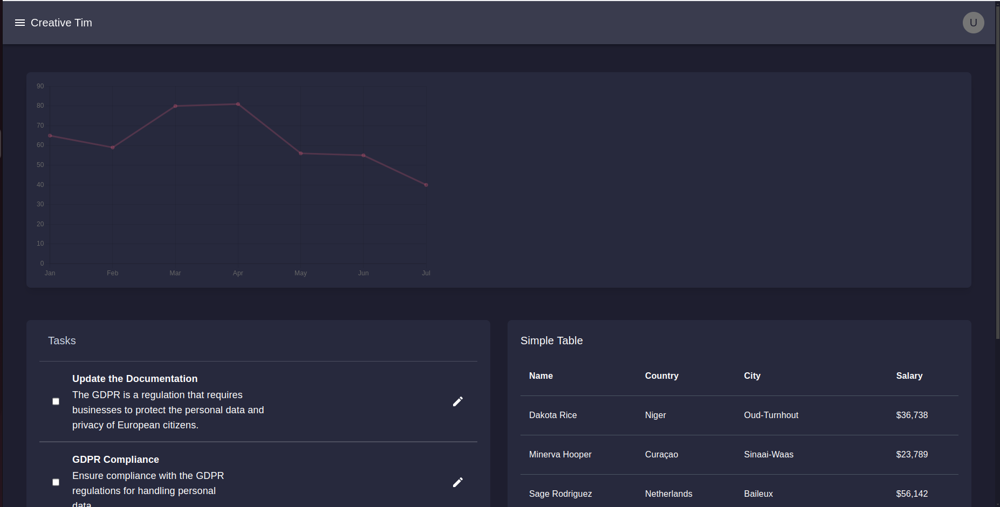

# Dashboard


- 🌐 demo link: [Live Demo](https://dashboard-ui-seven-ruddy.vercel.app/)


# 🪟 UI

 

### Prerequisites

- e.g., Node.js, npm.

### Getting Started

1. Clone the repository:
   ```bash
   git clone https://github.com/vivek20Eng/Dashboard-UI.git
2. Clone the repository:
   ```bash  
    cd Dashboard-UI
3. Clone the repository:
   ```bash  
    npm install
4. Clone the repository:
   ```bash  
    npm start
5. Clone the repository:
   ```bash  
    http://localhost:3000
